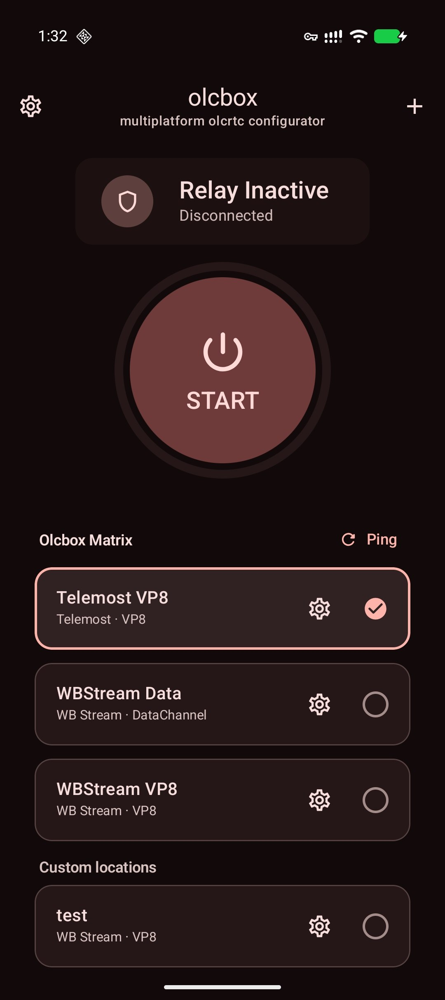
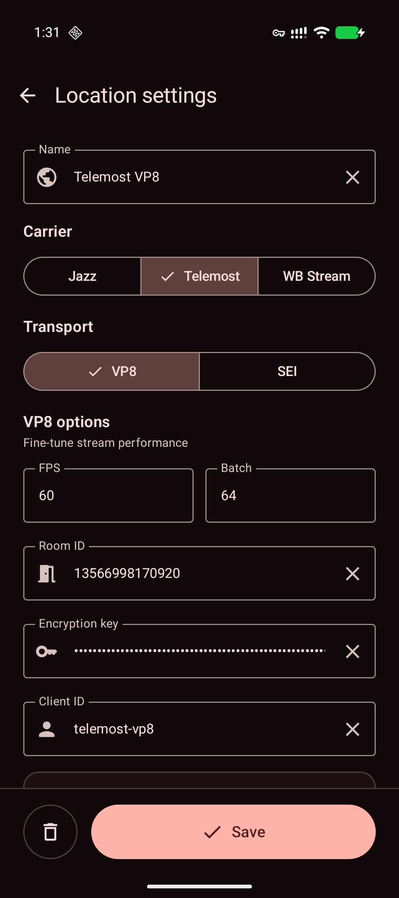
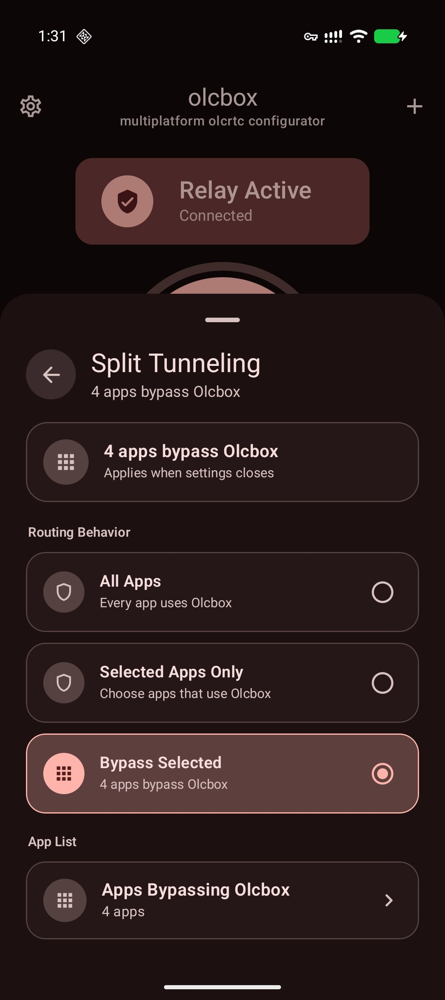

# Olcbox (Sing-box Compatibility Edition)

`olcrtc` configurator built with Kotlin Multiplatform and Compose.

Репозиторий адаптирован для бесперебойной работы с новыми и будущими версиями **sing-box (1.11.0, 1.12.0, 1.13.0, 1.14.0+)**, в которых были ужесточены требования к конфигурации и удалены устаревшие поля.

> [!IMPORTANT]  
> **Данный форк адаптирован исключительно для ОС Windows (Desktop).**  
> Компиляция под Android, iOS, macOS и Linux в данном репозитории **отключена** (соответствующие модули исключены из сборщика Gradle). Это позволяет собирать проект «из коробки» на любой Windows-машине без необходимости устанавливать тяжеловесные зависимости вроде Android SDK, NDK или Xcode.


---

## 🛠️ Совместимость с новыми версиями sing-box

В этой редакции устранены три критические ошибки запуска TUN-режима, приводившие к фатальным сбоям (`Desktop start failed: tun2socks exited before Olcbox was ready`):

1. **Миграция Sniffing (Совместимость с 1.11.0 / 1.13.0+)**:
   * Из конфигурации TUN-интерфейса (`inbounds`) удалены устаревшие поля `sniff` и `sniff_override_destination`, вызывавшие ошибку `legacy inbound fields are deprecated`.
   * Анализ протоколов (сниффинг) перенесен на современный механизм правил маршрутизации в `route.rules` с использованием правила `{"action": "sniff"}`.

2. **Обязательный резолвер доменов (Совместимость с 1.12.0 / 1.14.0+)**:
   * В блок `"route"` добавлен параметр `"default_domain_resolver": "dns-direct"`.
   * Это предотвращает сбой `missing 'route.default_domain_resolver' or 'domain_resolver' in dial fields`, возникающий из-за того, что `sing-box` требует явного резолвера для системных нужд (например, для автоматического скачивания и обновления файлов гео-правил `geoip-ru.srs` через `direct`).

3. **Устранение избыточного обхода (Empty Detour Fix)**:
   * Из конфигурации прямого DNS (`dns-direct`) удален параметр `"detour": "direct"`.
   * В новых версиях `sing-box` системные запросы по умолчанию уходят напрямую. Попытка направить их на пустой outbound `direct` вызывает ошибку `detour to an empty direct outbound makes no sense`.

4. **Стабильность WebRTC соединений**:
   * Устранена проблема частых разрывов соединений со стороны клиентов (особенно на WB Stream и Jitsi). Ранее краш `sing-box` приводил к мгновенному экстренному закрытию процесса `olcrtc` на клиенте, из-за чего на сервере закрывались треки (`readVP8Track closed ... err=EOF`) и фиксировались пропущенные пинги (`missed pongs`).

---


<p align="center">
  
  
  
</p>

## Status
Alpha version.
Not intended for production use.

## Support
Support options are not publicly listed. Contact the author if needed.

> **Автор ничего не продаёт.  
> Не продаются приложение, доступ, конфигурации, подписки или услуги поддержки.  
> Возможен только добровольный донат.**

## Legal Notice
This software is intended for development, testing and research purposes only.

The author does not provide any guarantees regarding:
- availability of network access
- compatibility with specific services
- compliance with any external restrictions

Users are solely responsible for how they use this software and must comply with applicable laws.

## Usage Restrictions
This software is not intended to be used for bypassing access restrictions or violating applicable laws.
The author does not support or encourage such use.

## Features
- One-tap tunnel start/stop with live relay status.
- Saved connection profiles with active location selection.
- Providers: Jazz, Telemost, WB Stream, Jitsi.
- Transports: DataChannel, VP8, SEI.
- VP8 tuning: FPS and batch size.
- Connectivity checks for individual locations.
- Config import from clipboard/file and export to clipboard.
- Diagnostics log view with log export.
- Android TUN/proxy modes, SOCKS5 credentials, split tunneling.
- Network migration, reconnect handling, and watchdog recovery.

## Platform Matrix

| Platform | Modes | Status / Runtime in this Fork |
| --- | --- | --- |
| **Windows** | TUN, Proxy | **Active & Optimized** (via local `olcrtc` SOCKS5, `tun2socks`, `sing-box`) |
| Android | - | *Disabled / Not compiled* |
| iOS | - | *Disabled / Not compiled* |
| macOS | - | *Disabled / Not compiled* |
| Linux | - | *Disabled / Not compiled* |


## Requirements

| Area | Requirement | Details / Paths |
| --- | --- | --- |
| **JVM** | JDK 17+ | Required to compile and run the Kotlin Multiplatform application. |
| **Go Toolchain** | Go 1.22+ | Required for local compilation of `olcrtc` binary. |
| **olcrtc Repository** | Sibling directory `../olcrtc` | Used to build `olcrtc-windows-amd64.exe` during Gradle build. |
| **Windows TUN** | UAC elevation | Administrative privileges are required at startup to create the TUN interface. |

### 📦 Встроенные зависимости (Native Assets)

Для корректной сборки и работы приложения на Windows в папке `desktopApp/src/main/resources/native/` должны находиться следующие зависимости:

1. **`sing-box.exe`**: Основной исполняемый файл VPN-ядра (версии 1.9.3+ с поддержкой `gvisor`/`quic`).
2. **`wintun.dll`**: Драйвер для создания виртуального сетевого TUN-интерфейса в Windows.
3. **`libcronet.dll`**: Библиотека сетевого стека Chromium, необходимая клиенту `olcrtc` для обхода TLS-отпечатков (fingerprinting) при подключении к Jitsi.

*(Все эти файлы уже предварительно добавлены и отслеживаются в Git в текущей ветке.)*

### 🛠️ Настройка локальной сборки с olcRTC

По умолчанию Gradle ожидает исходники `olcrtc` в соседней папке по пути:
```text
../olcrtc
```

Если ваша папка с исходниками `olcrtc` имеет другое имя (например, `olcrtc-master`), вы должны переопределить путь к репозиторию с помощью переменной окружения `OLCRTC_REPO` перед сборкой.

#### Примеры запуска:

**В Bash (Linux/macOS):**
```bash
OLCRTC_REPO=../olcrtc-master ./gradlew :desktopApp:run
```

**В PowerShell (Windows):**
```powershell
$env:OLCRTC_REPO="C:\Users\LiTar\Desktop\olc\olcrtc-master"
.\gradlew.bat :desktopApp:run
```

## Commands

| Task | Command |
| --- | --- |
| Android debug APK | `./gradlew :androidApp:assembleDebug` |
| Install Android debug APK | `./gradlew :androidApp:installDebug` |
| iOS simulator app | `xcodebuild -project iosApp/iosApp.xcodeproj -scheme iosApp -sdk iphonesimulator -configuration Debug build` |
| Run desktop app | `./gradlew :desktopApp:run` |
| Run desktop app with hot reload | `./gradlew :desktopApp:hotRun --auto` |
| Build desktop native assets | `./gradlew :desktopApp:buildDesktopNativeAssets` |
| Package current host OS | `./gradlew :desktopApp:packageReleaseDistributionForCurrentOS` |
| Main checks | `./gradlew :sharedUI:jvmTest :desktopApp:compileKotlin :androidApp:assembleDebug` |
| JVM tests | `./gradlew :sharedUI:jvmTest` |

## Build Outputs

| Target | Command | Output |
| --- | --- | --- |
| Android debug | `./gradlew :androidApp:assembleDebug` | `androidApp/build/outputs/apk/debug/androidApp-debug.apk` |
| Android release | `./gradlew :androidApp:assembleRelease` | `androidApp/build/outputs/apk/release/androidApp-release.apk` |
| iOS simulator | `xcodebuild -project iosApp/iosApp.xcodeproj -scheme iosApp -sdk iphonesimulator -configuration Debug build` | Xcode DerivedData app product |
| macOS DMG | `./gradlew :desktopApp:packageReleaseDmg` | `desktopApp/build/compose/binaries/main-release/dmg/Olcbox-1.0.0.dmg` |
| Windows EXE | `.\gradlew.bat :desktopApp:packageReleaseExe` | `desktopApp\build\compose\binaries\main-release\exe\Olcbox-1.0.0.exe` |
| Windows MSI | `.\gradlew.bat :desktopApp:packageReleaseMsi` | `desktopApp\build\compose\binaries\main-release\msi\Olcbox-1.0.0.msi` |
| Linux AppImage | `./gradlew :desktopApp:packageReleaseLinuxAppImage` | `desktopApp/build/compose/binaries/main-release/appimage/Olcbox-1.0.0-amd64.AppImage` |

## Native Assets

| Asset | Path |
| --- | --- |
| macOS `olcrtc` | `desktopApp/build/generated/desktopNativeResources/native/olcrtc-darwin-arm64` |
| Linux `olcrtc` | `desktopApp/build/generated/desktopNativeResources/native/olcrtc-linux-amd64` |
| Linux `olcrtc` ARM | `desktopApp/build/generated/desktopNativeResources/native/olcrtc-linux-arm64` |
| Windows `olcrtc` | `desktopApp/build/generated/desktopNativeResources/native/olcrtc-windows-amd64.exe` |
| Linux `hev-socks5-tunnel` | `desktopApp/build/generated/desktopNativeResources/native/hev-socks5-tunnel-linux-amd64` |
| Linux `hev-socks5-tunnel` ARM | `desktopApp/build/generated/desktopNativeResources/native/hev-socks5-tunnel-linux-arm64` |
| Windows `hev-socks5-tunnel` | `desktopApp/build/generated/desktopNativeResources/native/hev-socks5-tunnel-windows-amd64.exe` |
| Windows Wintun runtime | `desktopApp/build/generated/desktopNativeResources/native/wintun.dll` |

## Notes

- Android native ABIs: `armeabi-v7a`, `arm64-v8a`, `x86_64`.
- Android release builds require `keystore.properties` in the repository root.
- macOS DMG output is not notarized unless signing/notarization is configured separately.
- Windows installers must be built on Windows with `jpackage` and WiX available.
- Linux TUN interface: `olcbox0`.
- Linux stop removes policy routes and reverts `systemd-resolved` settings when `resolvectl` is available.

`keystore.properties`:

```properties
storeFile=/absolute/path/to/release.keystore
storePassword=...
keyAlias=...
keyPassword=...
```

Linux privilege override:

Linux privilege override:

```bash
OLCBOX_LINUX_PRIVILEGE=sudo ./gradlew :desktopApp:run
OLCBOX_LINUX_PRIVILEGE=pkexec ./gradlew :desktopApp:run
```
